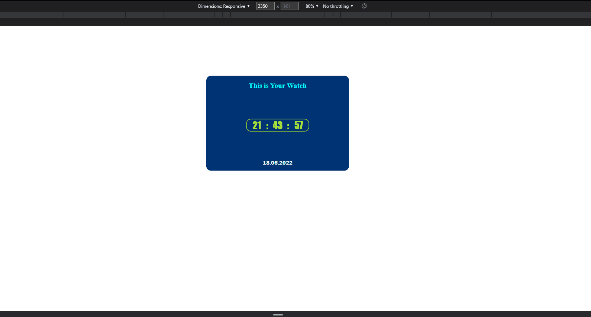
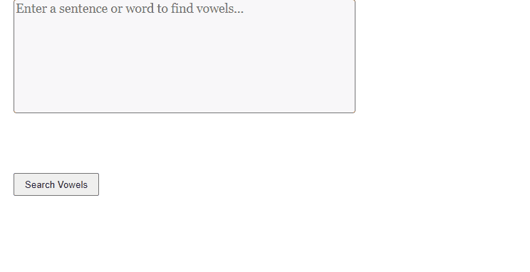

# DigitalClock and Vowels Finder Pages
## These two projects are two of the projects worked on weekly.

### In this project, I applied setInterval() function to make digital Clock and worked on asynchron programing

### In this project, I worked on two type solution for finding vowels in sentence, and prefer to apply short one and clear

